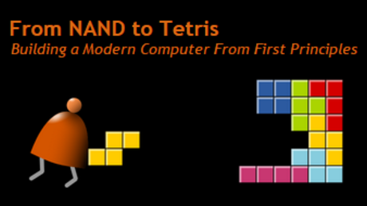

# Nand2Tetris

**About this Course** :
In this project-centered course* you will build a modern computer system, from the ground up. We’ll divide this fascinating journey into six hands-on projects that will take you from constructing elementary logic gates all the way through creating a fully functioning general purpose computer. In the process, you will learn - in the most direct and constructive way - how computers work, and how they are designed.

**Conducted by : Hebrew University of Jerusalem

**What you’ll need**:
This is a self-contained course: all the knowledge necessary to succeed in the course and build the computer system will be given as part of the learning experience. Therefore, we assume no previous computer science or engineering knowledge, and all learners are welcome aboard. You will need no physical materials, since you will build the computer on your own PC, using a software-based hardware simulator, just like real computers are designed by computer engineers in the field. The hardware simulator, as well as other software tools, will be supplied freely after you enroll in the course.

Nand2Tetris website: http://nand2tetris.org/

* Project 0: Introduction 
* Project 1: Boolean Logic
* Project 2: Boolean Arithmetic
* Project 3: Sequential Logic   
* Project 4: Machine Language 
* Project 5: Computer Architecture  
* Project 6: Assembler
