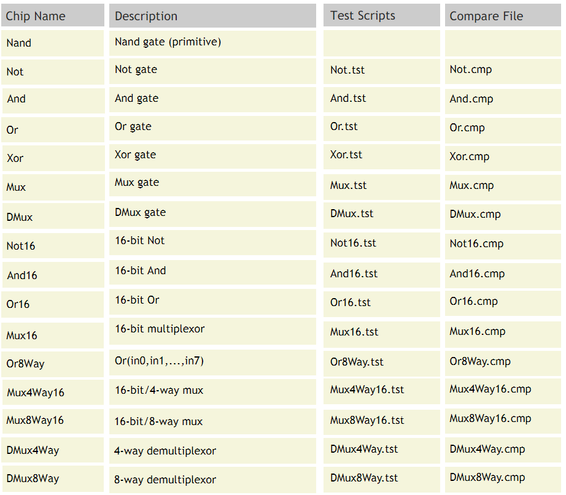

# Project 01 : ELementary Logic Gates

**Background** :
A typical computer architecture is based on a set of elementary logic gates like
And, Or, Mux, etc., as well as their bit-wise versions And16, Or16, Mux16, etc.
(assuming a 16-bit machine). This project engages you in the construction of
a typical set of basic logic gates. These gates form the elementary building
blocks from which more complex chips will be later constructed.

**Objective** :
Build all the logic gates described in Chapter 1 (see list below), yielding a basic chip-set.
The only building blocks that you can use in this project are primitive Nand gates and
the composite gates that you will gradually build on top of them.

**Chips** : 

**Contract**
When loaded into the supplied Hardware Simulator, your chip design (modified .hdl program), tested on the supplied .tst script, should produce the outputs listed in the supplied .cmp file. If that is not the case, the simulator will let you know. This contract must be satisfied for each chip listed above, except for the Nand chip, which is considered primitive, and thus there is no need to implement it.
