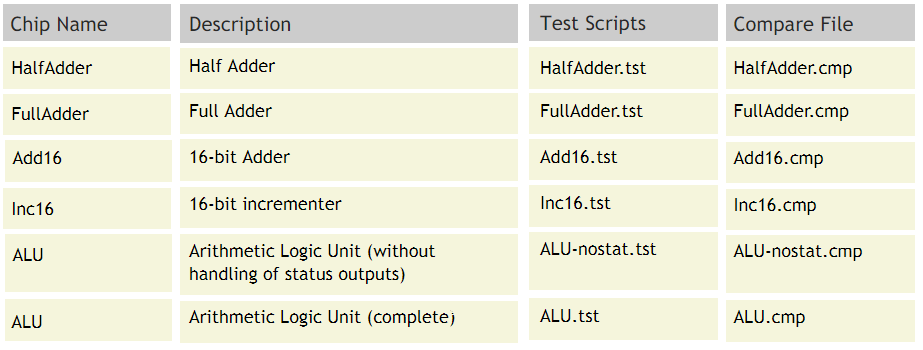

# Project 02 : Combinational Chips

**Background** :
The centerpiece of the computer's architecture is the CPU, or Central Processing Unit, 
and the centerpiece of the CPU is the ALU, or Arithmetic-Logic Unit. In this project
you will gradually build a set of chips, culminating in the construction of the
ALU chip of the Hack computer. All the chips built in this project are standard,
except for the ALU itself, which differs from one computer architecture to another.

**Objective**
Build all the chips described in Chapter 2 (see list below), leading up to an Arithmetic Logic Unit - the Hack computer's ALU. The only building blocks that you can use are the chips described in chapter 1 and the chips that you will gradually build in this project.

**Chips** :

**Proposed Implementation** :
When loaded into the supplied Hardware Simulator, your chip design (modified .hdl program), 
tested on the supplied .tst script, should produce the outputs listed in the supplied .cmp file. 
If that is not the case, the simulator will let you know.

**Contract** :
When loaded into the supplied Hardware Simulator, your chip design (modified .hdl program), 
tested on the supplied .tst script, should produce the outputs listed in
the supplied .cmp file. If that is not the case, the simulator will let you know.
