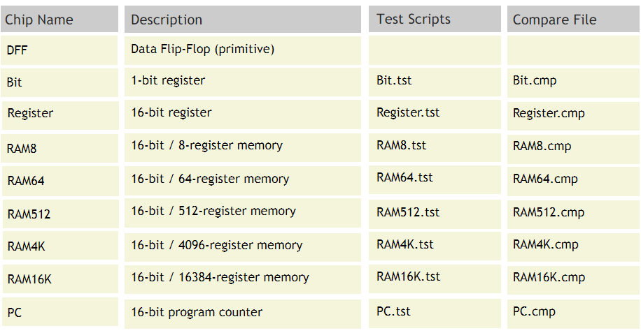

# Project 03 : Sequential Chips

**Background**:
The computer's main memory, also called Random Access Memory, or RAM, is an addressable sequence of n-bit registers, each designed to hold an n-bit value. In this project you will gradually build a RAM unit. This involves two main issues: (i) how to use gate logic to store bits persistently, over time, and (ii) how to use gate logic to locate ("address") the memory register on which we wish to operate.

**Objective**:
Build all the chips described in Chapter 3 (see list below), leading up to a Random Access Memory (RAM) unit. The only building blocks that you can use are primitive DFF gates, chips that you will build on top of them, and chips described in previous chapters.

**Chips** : 

**Contract**:
When loaded into the supplied Hardware Simulator, your chip design (modified .hdl program), tested on the supplied .tst script, should produce the outputs listed in the supplied .cmp file. If that is not the case, the simulator will let you know. This contract must be satisfied for each chip listed above, except for the DFF chip, which is considered primitive, and thus there is no need to implement it.
