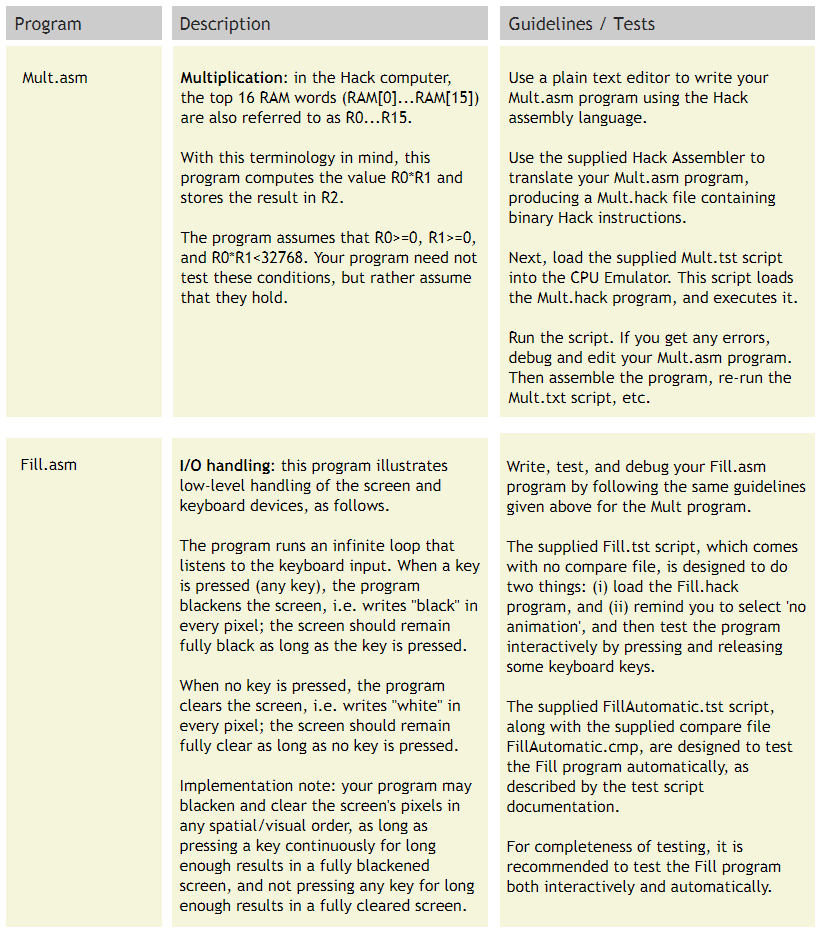

# Project 04 : Machine Language Programming

**Background**:
Every hardware platform is designed to execute commands in a certain machine language, expressed using agreed-upon binary codes. Writing programs directly in binary code is a possible, yet unnecessary. Instead, we can write such programs using a low-level symbolic language, called assembly, and have them translated into binary code by a program called assembler. In this project you will write some low-level assembly programs, and will be forever thankful for high-level languages like Java and Python. (Actually, assembly programming can be highly rewarding, allowing direct and complete control of the underlying machine.)

**Objective**:
To get a taste of low-level programming in machine language, and to get acquainted with the Hack computer platform. In the process of working on this project, you will become familiar with the assembly process - translating from symbolic language to machine-language - and you will appreciate visually how native binary code executes on the target hardware platform. These lessons will be learned in the context of writing and testing two low-level programs, as follows.

 **Programs**:
 
 
**Contract**:
Write and test the two programs described above. When executed on the supplied CPU emulator, your programs should generate the results mandated by the specified tests.
