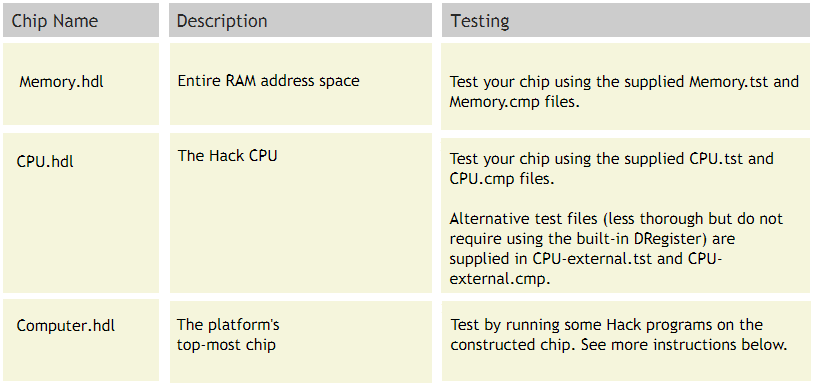

# Project 05 : Computer Architecture

**Background** :
In previous projects we've built the computer's basic processing and storage devices (ALU and RAM, respectively). In this project we will put everything together, yielding the complete Hack Hardware Platform. The result will be a general-purpose computer that can run programs written in the Hack machine language.

**Objective** :
Complete the construction of the Hack CPU and the Hack hardware platform, leading up to the top-most Computer chip.

**Chips**:

**Contract** :
The computer platform that you build should be capable of executing programs written in the Hack machine language, specified in Chapter 4. Demonstrate this capability by having your Computer chip run the three test programs given below
