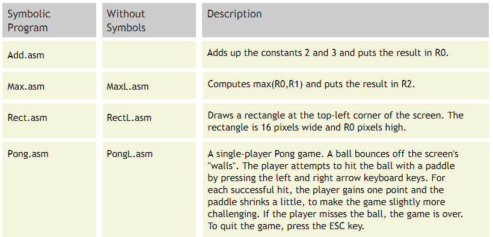

# Project 06 : The Assembler

**Background** :
Low-level machine programs are rarely written by humans. Typically, they are generated by compilers. Yet humans can inspect the translated code and learn important lessons about how to write their high-level programs better, in a way that avoids low-level pitfalls and exploits the underlying hardware better. One of the key players in this translation process is the assembler -- a program designed to translate code written in a symbolic machine language into code written in binary machine language.

This project marks an exciting landmark in our Nand to Tetris odyssey: it deals with building the first rung up the software hierarchy, which will eventually end up in the construction of a compiler for a Java-like high-level language. But, first things first.

**Objective** :
Write an Assembler program that translates programs written in the symbolic Hack assembly language into binary code that can execute on the Hack hardware platform built in the previous projects.

**Contract** :
There are three ways to describe the desired behavior of your assembler: (i) When loaded into your assembler, a Prog.asm file containing a valid Hack assembly language program should be translated into the correct Hack binary code and stored in a Prog.hack file. (ii) The output produced by your assembler must be identical to the output produced by the Assembler supplied with the Nand2Tetris Software Suite. (iii) Your assembler must implement the translation specification.

**Test Programs** :
Each test program except the first one comes in two versions: Prog.asm is an assembly program; ProgL.asm is the very same program, Less the symbols (each symbol is replaced with an explicit memory address).

**The Pong program** supplied above was written in the Java-like high-level Jack language and translated into the Hack assembly language by the Jack compiler (Jack and the Jack compiler are described in Chapter 9 and in Chapters 10-11, respectively). Although the original Jack program is only about 300 lines of Jack code, the executable Pong code is naturally much longer. Running this interactive program in the supplied CPU Emulator is a slow affair, so don't expect a high-powered Pong game. This slowness is actually a virtue, since it enables your eye to track the graphical behavior of the program. And don't worry! as we continue to build the software platform in the next few projects, Pong and and other games will run much faster.

